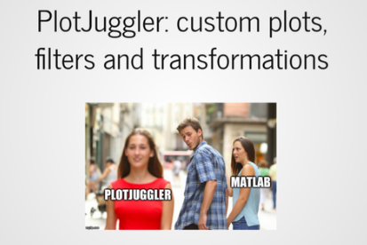

[](https://github.com/facontidavide/PlotJuggler/actions/workflows/windows.yaml)
[](https://github.com/facontidavide/PlotJuggler/actions/workflows/ubuntu.yaml)
[](https://github.com/facontidavide/PlotJuggler/actions/workflows/macos.yaml)
[](https://github.com/facontidavide/PlotJuggler/actions?query=workflow%3Aros1)
[](https://github.com/facontidavide/PlotJuggler/actions?query=workflow%3Aros2)
[](https://twitter.com/intent/tweet?text=I%20use%20PlotJuggler%20and%20it%20is%20amazing%0D%0A&url=https://github.com/facontidavide/PlotJuggler&via=facontidavide&hashtags=dataviz,plotjuggler,GoROS,PX4)

**Gold Sponsor**: [Greenzie](https://www.greenzie.com/)

# PlotJuggler 3.9

PlotJuggler is a tool to visualize time series that is **fast**, **powerful** and  **intuitive**.

Noteworthy features:

- Simple Drag & Drop user interface.
- Load __data from file__. 
- Connect to live __streaming__ of data.
- Save the visualization layout and configurations to re-use them later.
- Fast **OpenGL** visualization.
- Can handle **thousands** of timeseries and **millions** of data points.
- Transform your data using a simple editor: derivative, moving average, integral, etc…
- PlotJuggler can be easily extended using __plugins__.


## Data sources (file and streaming)

- Load CSV files.
- Load [ULog](https://dev.px4.io/v1.9.0/en/log/ulog_file_format.html) (PX4).
- Subscribe to many different streaming sources: MQTT, WebSockets, ZeroMQ, UDP, etc.
- Understand data formats such as JSON, CBOR, BSON, Message Pack, etc.
- Well integrated with [ROS](https://www.ros.org/): open *rosbags* and/or subscribe to ROS *topics* (both ROS1 and ROS2).
- Supports the [Lab Streaming Layer](https://labstreaminglayer.readthedocs.io/info/intro.html), that is used by [many devices](https://labstreaminglayer.readthedocs.io/info/supported_devices.html).
- Easily add your custom data source and/or formats...


## Transform and analyze your data
PlotJuggler makes it easy to visualize data but also to analyze it.
You can manipulate your time series using a simple and extendable Transform Editor.


Alternatively, you may use the Custom Function Editor, which allows you to create Multi-input / Single-output functions
using a scripting language based on [Lua](https://www.tutorialspoint.com/lua/index.htm). 

If you are not familiar with Lua, don't be afraid, you won't need more than 5 minutes to learn it ;)


## Tutorials

To learn how to use PlotJuggler, check the tutorials here:

| Tutorial 1   |  Tutorial 2 | Tutorial 3 |
:-------------------------:|:-------------------------:|:-------------------------:
| [](https://slides.com/davidefaconti/introduction-to-plotjuggler) | [](https://slides.com/davidefaconti/plotjuggler-data) | [](https://slides.com/davidefaconti/plotjuggler-transforms) |

## Supported plugins

Some plugins can be found in a different repository. The individual README files
*should* include all the information needed to compile and use the plugin.

Please submit specific issues, Pull Requests and questions on the related Github repository:

- [MQTT DataStreamer](https://github.com/PlotJuggler/plotjuggler-mqtt).
- [Lab Streaming Layer DataStreamer](https://github.com/PlotJuggler/plotjuggler-lsl).
- [ROS plugins](https://github.com/PlotJuggler/plotjuggler-ros-plugins).
- [CAN .dbg DataLoader](https://github.com/PlotJuggler/plotjuggler-CAN-dbs).

If you want a simple example to learn how to write your own plugins, have a look at
[PlotJuggler/plotjuggler-sample-plugins](https://github.com/PlotJuggler/plotjuggler-sample-plugins)

## Installation

## Snap (recommended in Ubuntu, to ROS users too)

The snap contains a version of PlotJuggler that can work with either ROS1 or ROS2. 


To install it in Ubuntu 22.04, with ROS2 support, run:

```
sudo snap install plotjuggler
```

If you are still using ROS1 (Ubuntu 20.04), install instead:

```
sudo snap install plotjuggler-ros
```

### Windows Binary installer

This installer does __not__ include ROS plugins.

**Windows Installer**: 
[PlotJuggler-Windows-3.9.0-installer](https://github.com/facontidavide/PlotJuggler/releases/download/3.9.0/PlotJuggler-Windows-3.9.0-installer.exe)

### Debian packages for ROS User

Install the ROS packages with: 

```
sudo apt install ros-$ROS_DISTRO-plotjuggler-ros
```
To launch PlotJuggler on ROS, use the command:

```
rosrun plotjuggler plotjuggler
```

or, if are using ROS2:

```
ros2 run plotjuggler plotjuggler
```

ROS plugins are available in a separate repository: https://github.com/PlotJuggler/plotjuggler-ros-plugins

Please take a look at the instructions in that repository if you want to compile PJ and its ROS plugins from source.


## Compile from source

You can find the detailed instructions here: [COMPILE.md](COMPILE.md).

# Sponsorship and commercial support

PlotJuggler required a lot of work to develop and maintain; my goal is to build the most 
intuitive and powerful tool to visualize data and timeseries.

If you find PlotJuggler useful, consider donating [PayPal](https://www.paypal.me/facontidavide) or becoming a 
[Github Sponsor](https://github.com/sponsors/facontidavide).

If you need to extend any of the functionalities of PlotJuggler to cover a specific 
need or to parse your custom data formats, you can receive commercial
support from the main author, [Davide Faconti](mailto:davide.faconti@gmail.com).

# License

PlotJuggler is released under the [Mozilla Public License Version 2.0](LICENSE.md),
which allows users to develop closed-source plugins.

Please note that some third-party dependencies (including Qt) use the
**GNU Lesser General Public License**.

# Star History

[](https://star-history.com/#facontidavide/PlotJuggler&Date)

# Contributors

<a href="https://github.com/facontidavide/plotjuggler/graphs/contributors">
  
</a>
